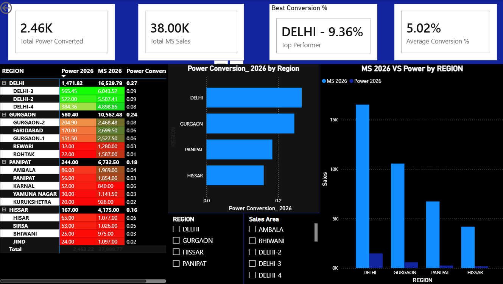

# Power Conversion Performance Dashboard

## Project Overview

This Power BI dashboard analyzes Power Conversion performance across multiple regions and sales areas from 1 June to 15 June 2026.

The dashboard helps monitor conversion efficiency, compare MS sales with power conversion volumes, and identify top-performing regions through interactive visualizations.

## Dashboard KPIs

* Total Power Converted
* Total MS Sales
* Average Conversion Percentage
* Top Performing Region

## Visualizations

* Region-wise Power Conversion Analysis
* MS Sales vs Power Conversion Comparison
* Performance Matrix with Conditional Formatting
* Region Filter
* Sales Area Filter

## Tools Used

* Power BI Desktop
* Power Query
* DAX
* Microsoft Excel

## Key Features

* Interactive dashboard with slicers
* Region-wise performance analysis
* KPI tracking and business insights
* Conditional formatting for performance monitoring
* Dynamic filtering and drill-down capability

## Skills Demonstrated

* Data Cleaning
* Data Transformation
* Data Visualization
* DAX Measure Creation
* Business Intelligence Reporting
* Dashboard Design

## Dashboard Preview

## Author

Jeff Verghese
